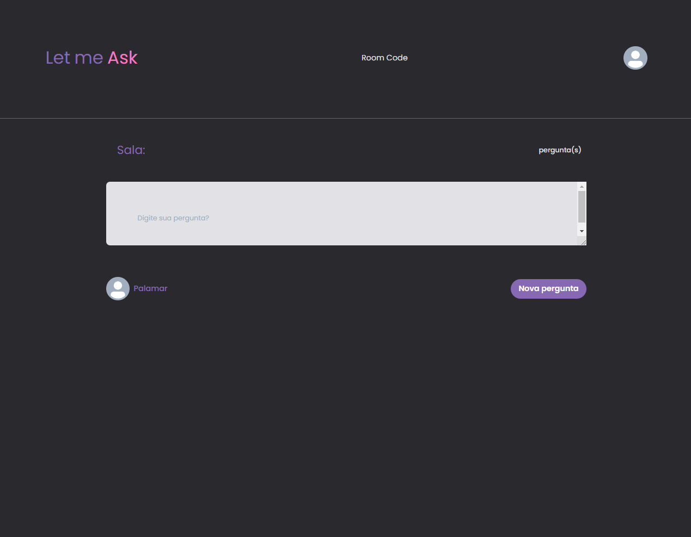

<div align="center">
    
     
     
</div>
<p align="center">   
  
    
</p>

<p align="center">
  <a href="#sobre">Sobre</a>&nbsp;&nbsp;&nbsp;|&nbsp;&nbsp;&nbsp;
  <a href="#tecnologias">Tecnologias</a>&nbsp;&nbsp;&nbsp;|&nbsp;&nbsp;&nbsp;
  <a href="#como-executar">Como Executar</a>&nbsp;&nbsp;&nbsp;|&nbsp;&nbsp;&nbsp;
  <a href="#licença">Licença</a>
</p>

## Sobre

Esta é uma aplicação que irá ajudar a você criador de conteúdo a interagir ainda mais com sua comunidade, respondendo as perguntas durante as suas streams.

## Tecnologias

-  [ReactJS](https://reactjs.org/)
-  [TypeScript](https://www.typescriptlang.org/)
-  [Chakra-ui](https://chakra-ui.com/)
-  [Firebase](https://firebase.google.com/)

## Como Executar

- ### **Pré-requisitos**

  - É **necessário** possuir o **[Node.js](https://nodejs.org/en/)** instalado no computador
  - É **necessário** possuir o **[Git](https://git-scm.com/)** instalado e configurado no computador
  - Também, é **preciso** ter um gerenciador de pacotes seja o **[NPM](https://www.npmjs.com/)** ou **[Yarn](https://yarnpkg.com/)**.

1. Faça um clone do repositório:

```sh
  $ git remote add origin git@github.com:aleksanderpalamar/LetmeAsk-app.git
```

2. Executando a Aplicação:

Crie um arquivo `.env` com as seguintes variáveis:

```sh
GITHUB_ID=
GITHUB_SECRET=

GOOGLE_CLIENT_ID=
GOOGLE_CLIENT_SECRET=

TWITTER_CLIENT_ID=
TWITTER_CLIENT_SECRET=

NEXTAUTH_SECRET=
```

```sh
  # Aplicação web
  $ cd LetmeAsk-app
  # Instalando as dependências do projeto.
  $ yarn # ou npm install   

  # Inicie a aplicação web
  $ yarn start
```

---
<sup>Projeto desenvolvido por [Aleksander Palamar](https://github.com/aleksanderpalamar), | [Site](https://palamarsolutionit.com.br).</sup>